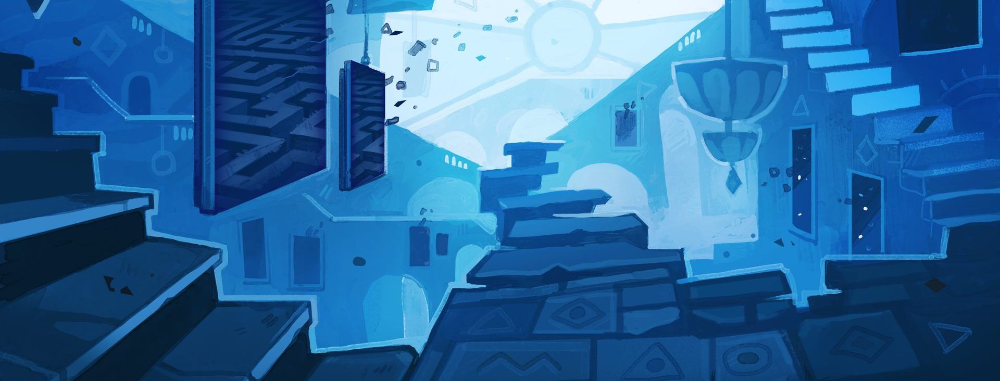

# Doorways: Open new Ways for your Mods

*Doorways* is a Cultist Simulator modding framework designed to assist
both standard (JSON-only) mod creators and DLL mod developers. Click one
of the links below to learn how to use Doorways in your own project.

## [Doorways for JSON Modding](https://github.com/Montessquio/Doorways/wiki/JSON-Modding)

## [Doorways for DLL Modding](https://github.com/Montessquio/Doorways/wiki/DLL-Modding)

## Installing Doorways

The easiest way to install *Doorways* is to [subscribe to it on the Steam Workshop](https://steamcommunity.com/sharedfiles/filedetails/?id=2883549031).

If you prefer to install it manually, download the latest *Doorways.zip* release from the [Doorways releases page](https://github.com/Montessquio/Doorways/releases). Extract it and place the folder `sh.monty.Doorways` in your mods directory, which can be located by opening Cultist Simulator, clicking on "Settings", and pressing the button "Browse Files".

Once Doorways is installed, enable the mod in the "Invisible Serapeum" menu and make sure it is the very first mod in the list.
Finally, restart the game and you're good to go!

## Contributing

Contributions to the Doorways Framework are welcome!
If you're unsure where to start, the [Help Wanted](https://github.com/Montessquio/Doorways/labels/help%20wanted)
tag is a good place to start. Once you're ready to submit your contribution, please submit a pull request with a verbose
description of your changes.

If you have questions regarding development, contact @Montessquio#9905 in the `#modding` channel of the [Cultist Simulator Discord Server](https://discord.gg/KxyFTZkUbQ).
